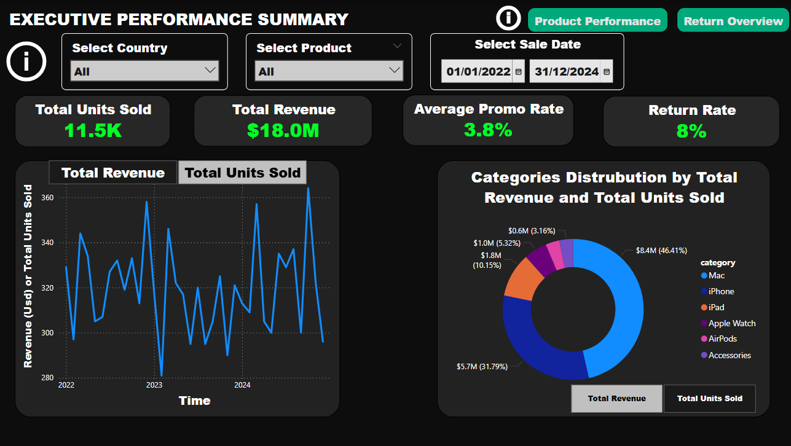
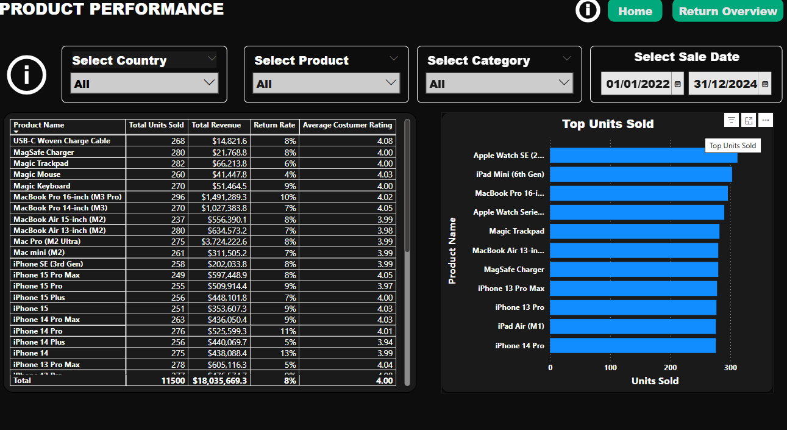
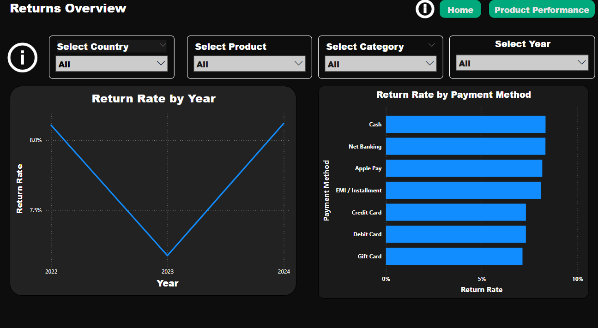

# Apple Sales Performance Dashboard & Data Modeling 

To ensure full transparency and professional ethics, the following disclaimer is hardcoded into the header of the data file (CSV) used in this project:

**⚠️ All figures are synthetically generated for educational / portfolio purposes.
They do not represent actual Apple Inc. financial data.**

## Project Overview:

**Data Collection and Initial Analysis**: Raw datasets were obtained from Kaggle for analysis.

**I performed data analysis to understand its underlying structure and identify variables.**

**Advanced Data Transformation (ETL)**:  I used Power Query to clean, reshape, and optimize the raw data.

**I performed data unification by extracting dimension tables and specialized facts from the underlying dataset.**

**Data Modeling and Relationship Management:**  I designed a star chart by creating complex relationships between tables.

**Dashboard Development and Presentation:** I developed a 3-page interactive dashboard focusing on executive summaries, product performance, and returns overview.

## Dashboard:

### Executive performance summary:



### Product performance:



### Returns Overview:



## Project Structure:

The project files are organized as follows:

 apple-sales-performance-dashboard & Data Modeling /

├── Dataset/

    └── apple_global_sale_dataset.csv

    └── costumers_dim.csv

    └── date_dimension.csv

    └── fx_rate.csv

    └── location_dimension.csv

    └── sales_metadata.csv

    └── status_dim.csv

├── image/

    └── executive_performance_summary.png

    └── product_performance.png

    └── returns_overview.png

├── original_dataset/

    └── apple_global_sales_dataset.csv

├── dashboard/

    └──dashboard.pbix

├── LICENCE # Project license

├── README.md # Project documentation

## How to Run
1. Clone the repository:
   ```bash
   git clone <repository-url>

## Author:
    ** BENSAID Younes **